# Rapid Assembly of Mitochondrial Genes from Public Transcriptome Data

## 🔬 About

This repository contains the complete bioinformatics pipeline and dataset for assembling mitochondrial genes, particularly cytochrome c oxidase subunit I (COX1), directly from public transcriptomic data. The methodology bypasses traditional wet-lab procedures, providing a cost-effective and time-efficient alternative for obtaining complete mitochondrial gene sequences.

*Last updated: January 2026*

# Targeted Gene Assembly Pipeline from Public Sequencing Data

A streamlined, web-based workflow for rapid gene assembly from public transcriptome and genome data using NCBI BLAST, CAP3 assembly, and sequence validation tools.

## Overview

This pipeline provides a lightweight, reproducible approach for assembling specific genes of interest from publicly available sequencing data without requiring local downloads of large SRA files. The workflow is particularly suited for mitochondrial gene recovery but can be adapted for any target gene.

## Workflow Diagram

```mermaid
flowchart TD
    subgraph INPUT["📥 INPUT PREPARATION"]
        A[("🧬 Reference Gene Sequence<br/>(GenBank/Custom)")] 
        B[("📊 Public SRA Datasets<br/>(NCBI SRA Database)")]
    end
    
    subgraph RETRIEVAL["🔍 TARGETED READ RETRIEVAL"]
        C["NCBI BLASTn Search<br/>━━━━━━━━━━━━━━<br/>• Algorithm: megablast<br/>• Max targets: 5,000<br/>• Word size: 16<br/>• Database: SRA"]
        D[("📄 Filtered FASTA Reads<br/>(Gene-specific subset)")]
    end
    
    subgraph ASSEMBLY["🔧 DE NOVO ASSEMBLY"]
        E["CAP3 Assembly<br/>━━━━━━━━━━━━━━<br/>• Overlap length: 40 bp<br/>• Identity cutoff: 90%<br/>• Platform: Galaxy Europe"]
        F[("🧩 Assembled Contigs")]
    end
    
    subgraph VALIDATION["✅ QUALITY CONTROL & VALIDATION"]
        G["ClustalW Alignment<br/>━━━━━━━━━━━━━━<br/>• Multi-sequence alignment<br/>• Orientation correction<br/>• Consistency check"]
        H["BLASTn Validation<br/>━━━━━━━━━━━━━━<br/>• Database: NCBI nr/nt<br/>• Species confirmation<br/>• Identity verification"]
    end
    
    subgraph OUTPUT["📤 OUTPUT"]
        I[("✨ Validated Gene Sequence<br/>(High-identity contigs)")]
    end
    
    A --> C
    B --> C
    C --> D
    D --> E
    E --> F
    F --> G
    G --> H
    H --> I
    
    style INPUT fill:#e3f2fd,stroke:#1976d2,stroke-width:2px
    style RETRIEVAL fill:#fff3e0,stroke:#f57c00,stroke-width:2px
    style ASSEMBLY fill:#e8f5e9,stroke:#388e3c,stroke-width:2px
    style VALIDATION fill:#fce4ec,stroke:#c2185b,stroke-width:2px
    style OUTPUT fill:#f3e5f5,stroke:#7b1fa2,stroke-width:2px
```



## Pipeline Steps

### Step 1: Reference Sequence Preparation

| Parameter | Description | Example |
|-----------|-------------|---------|
| **Source** | GenBank, RefSeq, or custom sequence | `OK504623.1` |
| **Gene Target** | Any gene of interest | COX1, CYTB, COX2, ND2, etc. |
| **Format** | FASTA format | Single sequence |

**Requirements:**
- Species-specific reference recommended for optimal sensitivity
- Complete or near-complete coding region preferred
- Record sequence length for coverage assessment

### Step 2: SRA Dataset Identification

Search NCBI SRA for relevant datasets:

```
https://www.ncbi.nlm.nih.gov/sra
```

**Selection Criteria:**
- ✅ High read quality metrics
- ✅ Adequate sequencing depth
- ✅ Appropriate tissue/developmental stage
- ✅ Correct taxonomic assignment

### Step 3: Targeted Read Retrieval via BLAST

Access NCBI BLASTn:
```
https://blast.ncbi.nlm.nih.gov/Blast.cgi
```

**Optimized Parameters:**

| Parameter | Value | Rationale |
|-----------|-------|-----------|
| Algorithm | megablast | Fast, high-identity searches |
| Database | SRA (Sequence Read Archive) | Target specific SRA runs |
| Max target sequences | 5,000 | Maximize read recovery |
| Max targets per window | 20 | Complete query coverage |
| Word size | 16 | Balance sensitivity/speed |

**Output:** Download aligned reads in FASTA format

### Step 4: De Novo Assembly with CAP3

Access Galaxy Europe:
```
https://usegalaxy.eu/
```

**CAP3 Parameters:**

| Parameter | Value |
|-----------|-------|
| Overlap length cutoff | 40 bp |
| Overlap percent identity | 90% |

**Expected Output:**
- Assembled contigs (`.fasta`)
- Assembly statistics
- Singlet sequences

### Step 5: Quality Assessment

#### 5a. Multi-Sequence Alignment (ClustalW)

- Align all assembled contigs
- Check sequence orientation
- Identify assembly artifacts
- Assess consistency across datasets

#### 5b. BLAST Validation

Query contigs against NCBI nr/nt database:
- Confirm taxonomic identity
- Verify gene assignment
- Calculate sequence identity

## Quick Start Example

```bash
# Conceptual workflow (web-based execution)

1. Obtain reference: GenBank accession → FASTA
2. Identify SRA runs: NCBI SRA search → Run accessions
3. BLAST search: Reference vs SRA → Filtered reads (FASTA)
4. Upload to Galaxy: Filtered reads → CAP3 tool
5. Align contigs: ClustalW → Orientation check
6. Validate: BLASTn vs nr/nt → Confirmed sequence
```

## Adapting for Different Targets

This workflow is **gene-agnostic**. To target a different gene:

| Target Type | Reference Source | Notes |
|-------------|------------------|-------|
| Mitochondrial genes | GenBank mitogenomes | High copy number, good recovery |
| Nuclear genes | RefSeq transcripts | May require more SRA datasets |
| Ribosomal RNA | SILVA/GenBank | Highly conserved regions |
| Custom markers | User-provided | Ensure quality reference |

### Substitution Checklist

- [ ] Replace reference sequence with target gene
- [ ] Adjust BLAST word size if needed (lower for divergent targets)
- [ ] Modify CAP3 identity cutoff for variable genes
- [ ] Update validation criteria

## Performance Expectations

| Metric | Typical Value |
|--------|---------------|
| Input reads (post-BLAST) | 100-500 per dataset |
| Assembly time | < 5 minutes |
| Contig recovery rate | 70-95% |
| Sequence identity | > 98% (species-specific ref) |

## Troubleshooting

| Issue | Possible Cause | Solution |
|-------|----------------|----------|
| No BLAST hits | Reference too divergent | Use closer species reference |
| Fragmented assembly | Insufficient read depth | Include more SRA datasets |
| Multiple contigs | Gene variants or paralogs | Validate each independently |
| Low identity scores | Assembly errors | Adjust CAP3 parameters |

## Tools & Resources

| Tool | URL | Purpose |
|------|-----|---------|
| NCBI BLAST | https://blast.ncbi.nlm.nih.gov | Read retrieval |
| NCBI SRA | https://www.ncbi.nlm.nih.gov/sra | Data source |
| Galaxy Europe | https://usegalaxy.eu | CAP3 assembly |
| ClustalW | Available on Galaxy/EMBL | Alignment |
| GenBank | https://www.ncbi.nlm.nih.gov/genbank | References |

## Citation

If you use this workflow, please cite the relevant tools:
- **BLAST:** Altschul SF, et al. (1990) J Mol Biol 215:403-410
- **CAP3:** Huang X, Madan A. (1999) Genome Res 9:868-877
- **ClustalW:** Thompson JD, et al. (1994) Nucleic Acids Res 22:4673-4680

## License

This workflow documentation is provided under [MIT License](LICENSE).

---

*Pipeline designed for accessibility and reproducibility using freely available web-based tools.*
